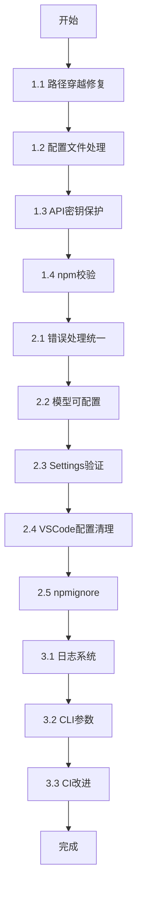

# Mentat-Code 安全与质量修复计划

## 概述

本计划针对代码审查中发现的安全漏洞和质量问题，按优先级分为三个阶段实施。

---

## 🔴 阶段一：严重问题修复 (Critical)

### 1.1 路径穿越安全漏洞修复

**问题位置**: 
- [`src/tools/read_file.rs:71`](src/tools/read_file.rs:71)
- [`src/tools/write_file.rs:76`](src/tools/write_file.rs:76)

**当前问题**: 仅检查 `..` 字符串，无法防御以下攻击方式：
- 绝对路径: `/etc/passwd`
- URL 编码: `%2e%2e/`
- 混合路径: `foo/../../../etc/passwd`

**解决方案**: 使用 `canonicalize()` + 工作目录限制

```rust
// src/tools/path_validator.rs (新文件)
use std::path::{Path, PathBuf};
use std::io;

pub struct PathValidator {
    workspace_root: PathBuf,
}

impl PathValidator {
    pub fn new() -> io::Result<Self> {
        Ok(Self {
            workspace_root: std::env::current_dir()?,
        })
    }
    
    pub fn validate(&self, path: &str) -> Result<PathBuf, String> {
        let requested = Path::new(path);
        
        // 1. 拒绝绝对路径
        if requested.is_absolute() {
            return Err("Absolute paths are not allowed".to_string());
        }
        
        // 2. 构建完整路径并规范化
        let full_path = self.workspace_root.join(requested);
        let canonical = full_path.canonicalize()
            .map_err(|e| format!("Invalid path: {}", e))?;
        
        // 3. 确保路径在工作目录内
        if !canonical.starts_with(&self.workspace_root) {
            return Err("Path traversal not allowed".to_string());
        }
        
        Ok(canonical)
    }
}
```

**测试用例补充**:
```rust
#[test]
fn test_absolute_path_blocked() {
    let input = json!({"file_path": "/etc/passwd"});
    let result = tool.execute(&input);
    assert!(result.contains("not allowed"));
}

#[test]
fn test_encoded_traversal_blocked() {
    let input = json!({"file_path": "foo/../../../etc/passwd"});
    let result = tool.execute(&input);
    assert!(result.contains("not allowed"));
}
```

---

### 1.2 配置文件处理优化

**问题位置**: [`src/main.rs:268-270`](src/main.rs:268)

**当前问题**: 
- 硬编码路径 `.mentat/settings.json`
- 使用 `expect()` 导致程序崩溃
- 错误信息可能暴露敏感路径

**解决方案**:

```rust
// src/config.rs (新文件)
use std::path::PathBuf;
use std::fs;

#[derive(Debug)]
pub enum ConfigError {
    NotFound(PathBuf),
    ParseError(String),
    ValidationError(String),
}

impl std::fmt::Display for ConfigError {
    fn fmt(&self, f: &mut std::fmt::Formatter<'_>) -> std::fmt::Result {
        match self {
            ConfigError::NotFound(_) => write!(f, "配置文件未找到，请运行 'mentat init' 初始化"),
            ConfigError::ParseError(_) => write!(f, "配置文件格式错误"),
            ConfigError::ValidationError(msg) => write!(f, "配置验证失败: {}", msg),
        }
    }
}

pub fn load_settings() -> Result<Settings, ConfigError> {
    let config_paths = [
        PathBuf::from(".mentat/settings.json"),
        dirs::config_dir().map(|p| p.join("mentat/settings.json")).unwrap_or_default(),
    ];
    
    for path in &config_paths {
        if path.exists() {
            let content = fs::read_to_string(path)
                .map_err(|_| ConfigError::NotFound(path.clone()))?;
            let settings: Settings = serde_json::from_str(&content)
                .map_err(|e| ConfigError::ParseError(e.to_string()))?;
            settings.validate()?;
            return Ok(settings);
        }
    }
    
    Err(ConfigError::NotFound(config_paths[0].clone()))
}
```

---

### 1.3 API 密钥泄露风险修复

**问题位置**: [`src/main.rs:270`](src/main.rs:270)

**解决方案**: 自定义错误类型，避免在错误信息中包含敏感数据

```rust
impl Settings {
    pub fn validate(&self) -> Result<(), ConfigError> {
        if self.env.api_key.is_empty() {
            return Err(ConfigError::ValidationError(
                "API key is required".to_string()
            ));
        }
        if !self.env.base_url.starts_with("http") {
            return Err(ConfigError::ValidationError(
                "Invalid base URL format".to_string()
            ));
        }
        Ok(())
    }
}

// main.rs 中的使用
fn main() -> Result<(), Box<dyn std::error::Error>> {
    let settings = config::load_settings().map_err(|e| {
        eprintln!("❌ {}", e);
        std::process::exit(1);
    })?;
    // ...
}
```

---

### 1.4 npm 包二进制下载安全

**问题位置**: 
- [`npm-package/run.js:24`](npm-package/run.js:24)
- [`npm-package/install.js:23`](npm-package/install.js:23)

**解决方案**: 添加 SHA256 校验

```javascript
// npm-package/checksums.json (新文件，由 CI 生成)
{
  "mentat-macos-arm64": "sha256-xxxx",
  "mentat-macos-x64": "sha256-xxxx",
  "mentat-linux-x64": "sha256-xxxx",
  "mentat-win-x64.exe": "sha256-xxxx"
}

// npm-package/install.js (修改)
const crypto = require('crypto');
const checksums = require('./checksums.json');

const verifyChecksum = (filePath, expected) => {
    const fileBuffer = fs.readFileSync(filePath);
    const hash = crypto.createHash('sha256').update(fileBuffer).digest('hex');
    if (hash !== expected) {
        throw new Error(`Checksum mismatch! Expected ${expected}, got ${hash}`);
    }
};

const install = async () => {
    const binary = getBinary();
    await binary.install();
    
    const platform = getPlatform();
    const expectedChecksum = checksums[`${NAME}-${platform}`];
    if (expectedChecksum) {
        verifyChecksum(binary.binaryPath, expectedChecksum);
    }
    console.log(`${NAME} has been installed and verified successfully!`);
};
```

---

## 🟠 阶段二：重要问题修复 (Important)

### 2.1 统一错误处理风格

**修改文件**: [`src/main.rs`](src/main.rs)

**策略**: 
- 关键路径使用 `?` 和 `Result`
- 非关键路径使用 `if let` 或 `unwrap_or_default()`
- 移除所有 `expect()` 调用

```rust
// Before
let settings_content = fs::read_to_string(settings_path).expect("无法读取配置文件");

// After
let settings_content = fs::read_to_string(settings_path)?;
```

### 2.2 模型名称可配置化

**修改文件**: [`src/main.rs:101`](src/main.rs:101)

```rust
// Settings 结构体扩展
#[derive(Deserialize)]
struct Settings {
    env: Env,
    #[serde(default)]
    model: Option<String>,
}

// ChatClient 中使用
model: settings.model.clone().unwrap_or_else(|| "claude-sonnet-4-20250514".to_string()),
```

### 2.3 Settings 验证逻辑

```rust
impl Settings {
    pub fn validate(&self) -> Result<(), ConfigError> {
        // API Key 验证
        if self.env.api_key.is_empty() {
            return Err(ConfigError::ValidationError("API key cannot be empty".into()));
        }
        
        // Base URL 验证
        if !self.env.base_url.starts_with("http://") && 
           !self.env.base_url.starts_with("https://") {
            return Err(ConfigError::ValidationError("Invalid base URL".into()));
        }
        
        // Proxy URL 验证 (如果存在)
        if let Some(proxy) = &self.env.https_proxy {
            if !proxy.starts_with("http://") && !proxy.starts_with("https://") {
                return Err(ConfigError::ValidationError("Invalid proxy URL".into()));
            }
        }
        
        Ok(())
    }
}
```

### 2.4 清理 VSCode 配置

**修改文件**: [`.vscode/settings.json`](.vscode/settings.json)

移除 Vue/i18n 相关配置，保留 Rust 相关配置：

```json
{
  "cSpell.words": ["mentat", "anthropic", "rustyline"],
  "editor.formatOnSave": true,
  "rust-analyzer.checkOnSave.command": "clippy",
  "[rust]": {
    "editor.defaultFormatter": "rust-lang.rust-analyzer"
  }
}
```

### 2.5 添加 .npmignore

**新建文件**: `npm-package/.npmignore`

```
# 排除不必要的文件
*.md
.gitignore
.github/
tests/
examples/
*.lock
```

---

## 🟢 阶段三：改进建议 (Suggestions)

### 3.1 添加日志系统

**依赖添加** (Cargo.toml):
```toml
env_logger = "0.11"
log = "0.4"
```

**使用示例**:
```rust
use log::{info, warn, error, debug};

fn main() {
    env_logger::init();
    info!("Mentat Code v0.1.0 启动");
    // ...
}
```

### 3.2 CLI 参数支持

**依赖添加** (Cargo.toml):
```toml
clap = { version = "4.5", features = ["derive"] }
```

**实现**:
```rust
use clap::Parser;

#[derive(Parser)]
#[command(name = "mentat")]
#[command(version = "0.1.0")]
#[command(about = "Your AI Coding Agent")]
struct Cli {
    /// 配置文件路径
    #[arg(short, long, default_value = ".mentat/settings.json")]
    config: String,
    
    /// 启用调试模式
    #[arg(short, long)]
    debug: bool,
}
```

### 3.3 CI/CD 改进

**修改文件**: `.github/workflows/release.yml` (如果存在)

添加以下步骤：
1. `cargo fmt --check` - 格式检查
2. `cargo clippy -- -D warnings` - Lint 检查
3. `cargo test` - 单元测试
4. 生成 checksums.json

---

## 文件变更清单

| 文件 | 操作 | 优先级 |
|------|------|--------|
| `src/tools/path_validator.rs` | 新建 | 🔴 Critical |
| `src/tools/read_file.rs` | 修改 | 🔴 Critical |
| `src/tools/write_file.rs` | 修改 | 🔴 Critical |
| `src/config.rs` | 新建 | 🔴 Critical |
| `src/main.rs` | 修改 | 🔴 Critical |
| `npm-package/checksums.json` | 新建 | 🔴 Critical |
| `npm-package/install.js` | 修改 | 🔴 Critical |
| `.vscode/settings.json` | 修改 | 🟠 Important |
| `npm-package/.npmignore` | 新建 | 🟠 Important |
| `Cargo.toml` | 修改 | 🟢 Suggestion |

---

## 实施顺序



---

## 风险评估

| 修改项 | 风险等级 | 回滚策略 |
|--------|----------|----------|
| 路径验证 | 中 | 可能影响合法路径访问，需充分测试 |
| 配置加载 | 低 | 向后兼容，旧配置仍可用 |
| npm 校验 | 中 | 校验失败时提供跳过选项 |
| CLI 参数 | 低 | 所有参数都有默认值 |
